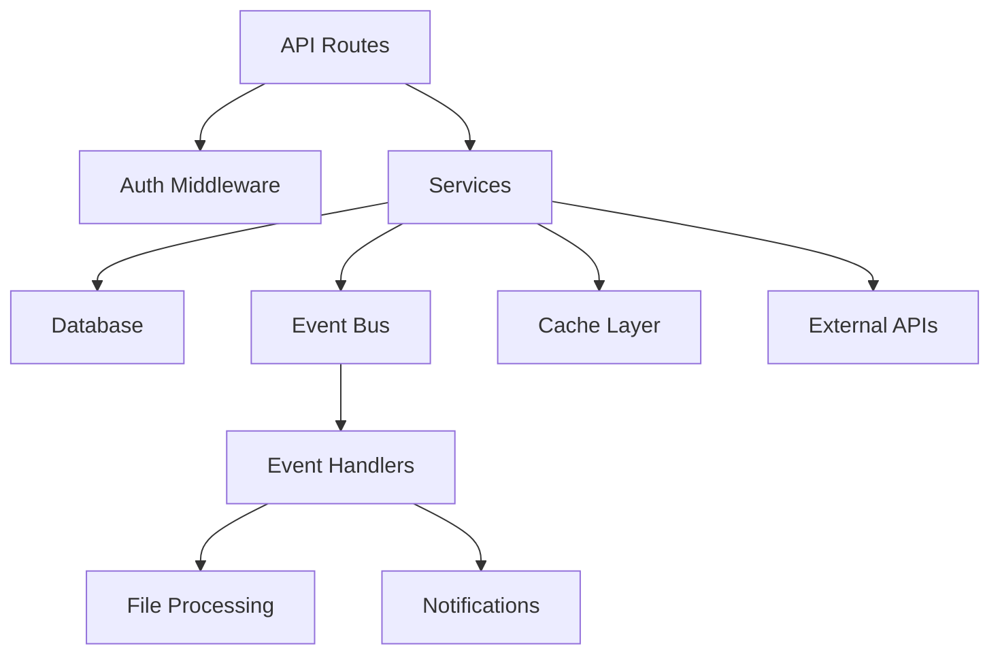
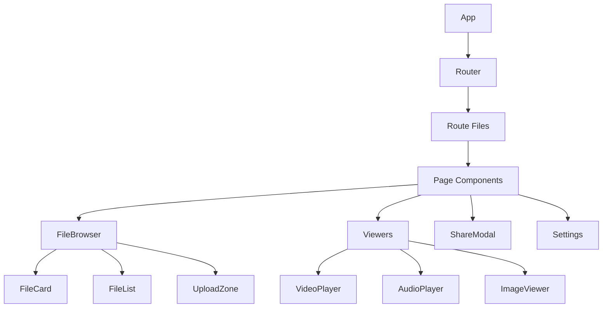
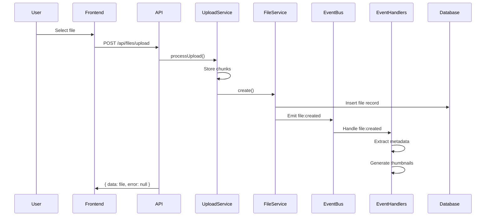
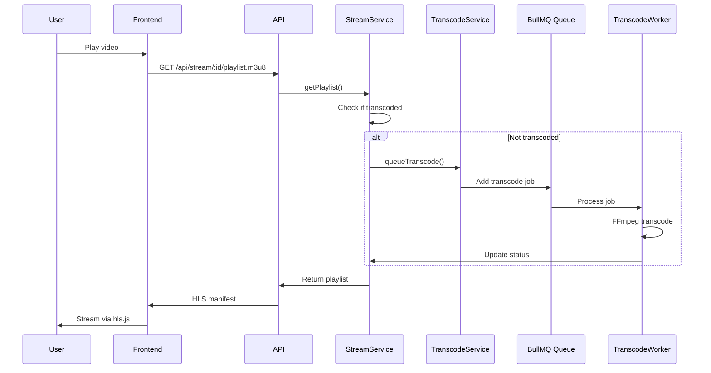
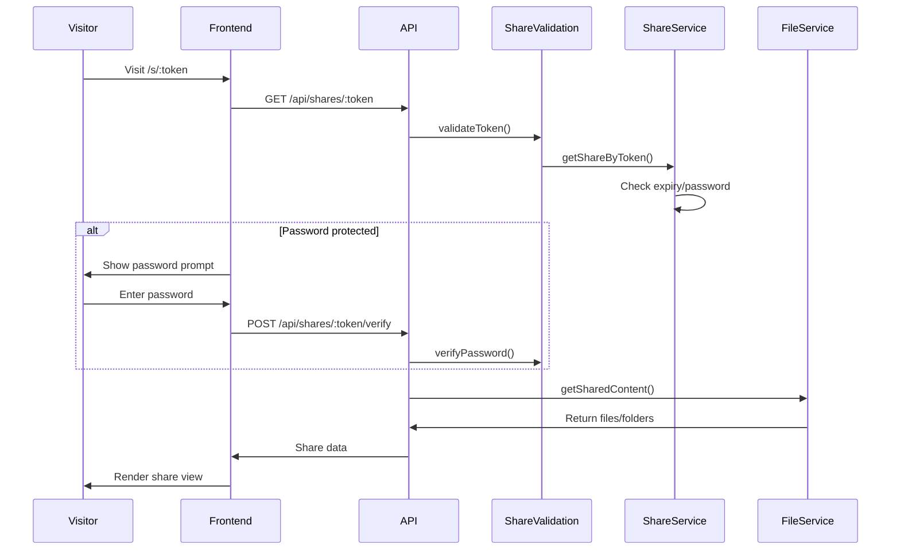

# Architecture

Petrel is a full-stack TypeScript application using a modern three-tier architecture with clear separation between frontend, backend, and data layers.

## Architecture Assessment Summary

**Overall Grade: B+ (85/100)**

The Petrel codebase demonstrates strong architectural foundations with excellent separation of concerns, consistent patterns, and modern tooling. The modular monorepo structure facilitates maintainability, while the event-driven backend provides good extensibility. Primary improvement areas include reducing service coupling, addressing the FileBrowser god component, and resolving authentication edge cases.

### Component Interactions (Grade: A-)
- **Strengths**: Well-defined module boundaries, event-driven decoupling, consistent API contracts
- **Concerns**: Moderate service coupling (0.4-0.5 range), some circular dependency risks

### State Management (Grade: B+)
- **Strengths**: Clear distinction between server and UI state, TanStack Query patterns
- **Concerns**: FileBrowser component has excessive state complexity (550+ lines)

### Code Organization (Grade: A-)
- **Strengths**: Feature-based module structure, consistent file naming
- **Concerns**: Some utility files approaching junk drawer status

### Error Handling (Grade: B+)
- **Strengths**: Consistent response shape, Pino structured logging
- **Concerns**: Inconsistent error messages, some any types in error boundaries

### Performance (Grade: B)
- **Strengths**: Caching infrastructure, lazy loading
- **Concerns**: Inefficient polling (5s intervals), N+1 query risks

### Testability (Grade: B)
- **Strengths**: Service layer testable, dependency injection patterns
- **Concerns**: Limited test coverage on frontend, missing integration tests

## System Overview

```
┌─────────────────────────────────────────────────────────────┐
│                        Frontend                              │
│  React + TanStack Router + TanStack Query + Tailwind CSS    │
└──────────────────────────┬──────────────────────────────────┘
                           │ HTTP/REST
┌──────────────────────────▼──────────────────────────────────┐
│                        Backend                               │
│     Elysia API + Services + Event Bus + Job Queue           │
│                      (Bun Runtime)                          │
└──────────────────────────┬──────────────────────────────────┘
                           │
           ┌────────────────┼────────────────┐
           ▼                ▼                ▼
     ┌──────────┐    ┌──────────┐    ┌──────────┐
     │  SQLite  │    │ Filesystem│    │  Redis   │
     │   (DB)   │    │ (Storage)│    │ (Cache/  │
     │          │    │          │    │  Queue)  │
     └──────────┘    └──────────┘    └──────────┘
```

## Component Hierarchy & Module Interactions

### Monorepo Structure

```
petrel-js/
├── apps/
│   ├── backend/           # Elysia API server
│   │   ├── src/
│   │   │   ├── modules/   # Feature modules (auth, files, shares, etc.)
│   │   │   ├── services/  # Business logic classes
│   │   │   ├── cache/     # Caching infrastructure
│   │   │   ├── events/    # Event bus and handlers
│   │   │   ├── workers/   # Background job workers
│   │   │   └── lib/       # Utilities (ffmpeg, storage, etc.)
│   │   └── index.ts       # Entry point
│   └── frontend/          # React SPA
│       ├── src/
│       │   ├── routes/    # TanStack file-based routes
│       │   ├── components/# React components
│       │   ├── hooks/     # Custom TanStack Query hooks
│       │   └── lib/       # Utilities (API client, etc.)
│       └── index.html
├── packages/
│   └── shared/            # Shared TypeScript types
│       └── src/types/
├── package.json           # Workspace root config
└── biome.json            # Linting/formatting config
```

### Backend Module Dependencies



### Service Layer Dependencies

The backend services have the following coupling relationships:

| Service | Dependencies | Coupling Score |
|---------|-------------|----------------|
| file.service.ts | metadata, thumbnail, upload | 0.6 |
| share.service.ts | file, folder | 0.4 |
| stream.service.ts | file, transcode, video | 0.7 |
| upload.service.ts | file, metadata | 0.5 |
| video.service.ts | transcode, thumbnail | 0.5 |

**Coupling Analysis**: Services generally follow good separation, but stream and file services have higher coupling due to shared media processing logic. Consider extracting common media utilities.

### Frontend Component Hierarchy



## Tech Stack

### Frontend
- **Framework**: React 19 with TypeScript
- **Router**: TanStack Router (file-based routing)
- **State**: TanStack Query for server state, React hooks for UI state
- **Styling**: Tailwind CSS 4 with custom darkmatter theme
- **UI Components**: shadcn/ui primitives (Radix UI + Tailwind)
- **Build**: Vite

### Backend
- **Framework**: Elysia (Bun-native, TypeScript-first)
- **ORM**: Drizzle ORM with type-safe queries
- **Database**: SQLite (Better SQLite 3)
- **Validation**: Zod for runtime type checking
- **Auth**: JWT access + refresh tokens via @elysiajs/jwt
- **Queue**: BullMQ with Redis for background jobs
- **Logging**: Pino with structured logging

### Media Processing
- **Video**: FFmpeg for transcoding, thumbnail extraction, metadata
- **Images**: Sharp for thumbnails and processing
- **Audio**: music-metadata for ID3/tags, FFmpeg for waveforms

## Request Flow

1. **Frontend**: User action triggers TanStack Query mutation/query
2. **API Client**: Request sent with JWT in Authorization header
3. **Backend**: Elysia receives request, CORS middleware processes
4. **Auth Middleware**: JWT verified, user attached to context
5. **Route Handler**: Validation runs, service method called
6. **Service**: Business logic executes, database queries via Drizzle
7. **Response**: JSON response returned, TanStack Query caches result
8. **UI**: React re-renders with new data

## Data Flow Diagrams

### File Upload Flow



### Video Streaming Flow



### Share Access Flow



## API Contract Patterns

### Consistent Response Shape

All API responses follow this structure:

```typescript
interface ApiResponse<T> {
  data: T | null;
  error: string | null;
}

// Success
{ data: { id: 1, name: "file.txt" }, error: null }

// Error
{ data: null, error: "File not found" }
```

### Type Safety Gaps

Current gaps in API type safety:

1. **Query Parameters**: Some endpoints use loose typing for query params
2. **Error Responses**: Error types not consistently defined
3. **WebSocket Events**: Event payloads lack runtime validation

**Recommended Improvements**:

```typescript
// Define explicit error types
export type ApiError = 
  | { code: 'NOT_FOUND'; message: string }
  | { code: 'VALIDATION_ERROR'; message: string; fields: string[] }
  | { code: 'UNAUTHORIZED'; message: string };

// Use strict query validation
.get('/', async ({ query }) => {
  // query is typed and validated
}, {
  query: t.Object({
    folderId: t.Optional(t.Number()),
    limit: t.Optional(t.Number({ default: 20 })),
    offset: t.Optional(t.Number({ default: 0 }))
  })
});
```

## Key Patterns

### Backend
- **Modules**: Each feature (auth, files, shares) is an Elysia instance with routes
- **Services**: Classes encapsulating business logic (FileService, ShareService)
- **Middleware**: Auth, rate limiting, logging via Elysia plugins
- **Events**: Event bus decouples side effects (thumbnails, metadata extraction)
- **Jobs**: BullMQ workers handle transcoding and ZIP generation

### Frontend
- **File Routes**: Routes defined by files in `routes/` directory
- **Query Hooks**: Custom hooks wrap TanStack Query for each entity
- **Mutations**: Optimistic updates with cache invalidation
- **Context Menu**: Global context menu system with action handlers

## Technical Debt Registry

### High Priority

| Issue | Location | Impact | Recommendation |
|-------|----------|--------|----------------|
| FileBrowser God Component | `FileBrowser.tsx` | 550+ lines, mixed concerns | Decompose into smaller components |
| JWT Plugin Pattern | `auth/middleware.ts` | Potential duplicate instances | Document strict usage pattern |
| Inefficient Polling | `hooks/useFiles.ts` | 5s polling for job status | Use WebSocket or SSE |

### Medium Priority

| Issue | Location | Impact | Recommendation |
|-------|----------|--------|----------------|
| Date Serialization | `share.service.ts` | Type inconsistencies | Standardize on ISO 8601 |
| Missing Error Boundaries | Multiple viewers | Poor error UX | Add component-level boundaries |
| Cache Invalidation | `cache/decorators/` | Potential stale data | Add cache versioning |

### Low Priority

| Issue | Location | Impact | Recommendation |
|-------|----------|--------|----------------|
| Utility File Growth | `lib/utils.ts` | 450+ lines | Split into focused modules |
| Inline Styles | Some components | Inconsistent styling | Migrate to Tailwind |
| Console Logging | Dev code | Production noise | Replace with logger |

## Performance Bottlenecks

### Identified Issues

1. **Polling Overhead**
   - File operations poll every 5 seconds
   - Job status polling is inefficient
   - **Recommendation**: Implement WebSocket or Server-Sent Events

2. **N+1 Query Risks**
   - File listing with thumbnails
   - Folder tree traversal
   - **Recommendation**: Use Drizzle's `with` for eager loading

3. **Cache Invalidation**
   - File updates don't consistently clear cache
   - Share token validation cache too aggressive
   - **Recommendation**: Implement cache tags for grouped invalidation

### Scalability Roadmap

#### Horizontal Scaling Considerations

Current stateful components that limit horizontal scaling:

1. **In-Memory Cache**: Default cache is in-memory
   - **Solution**: Redis cache implementation available, needs configuration

2. **File Upload State**: Upload chunks stored on single instance
   - **Solution**: Use shared storage (S3, NFS) for multi-instance deployments

3. **WebSocket Connections**: Real-time features use single-instance state
   - **Solution**: Implement Redis adapter for WebSocket broadcasting

#### Recommended Architecture for Scale

```
┌─────────────────┐     ┌─────────────────┐     ┌─────────────────┐
│   Load Balancer │────▶│  API Instance 1 │     │  API Instance 2 │
│    (nginx/ALB)  │     │   (Elysia)     │     │   (Elysia)     │
└─────────────────┘     └────────┬────────┘     └────────┬────────┘
                                 │                       │
                                 ▼                       ▼
                          ┌─────────────────────────────────────┐
                          │           Redis Cluster             │
                          │  (Cache + Pub/Sub + Session Store)  │
                          └─────────────────────────────────────┘
                                 │
                    ┌────────────┼────────────┐
                    ▼            ▼            ▼
             ┌──────────┐ ┌──────────┐ ┌──────────┐
             │ SQLite   │ │ BullMQ   │ │ Shared   │
             │ (Read    │ │ Workers  │ │ Storage  │
             │ Replica) │ │          │ │          │
             └──────────┘ └──────────┘ └──────────┘
```

## Architectural Smells

### 1. FileBrowser God Component

**Location**: `apps/frontend/src/components/file-browser/FileBrowser.tsx`

**Symptoms**:
- 550+ lines of code
- Manages selection state, upload state, view mode, context menu
- Mixed presentation and business logic

**Refactoring Strategy**:

```typescript
// Extract selection logic to hook
export function useFileSelection(files: File[]) {
  const [selectedIds, setSelectedIds] = useState<Set<number>>(new Set());
  // ... selection logic
  return { selectedIds, toggleSelection, selectAll, clearSelection };
}

// Extract upload logic to hook  
export function useFileUpload() {
  const [uploads, setUploads] = useState<UploadState[]>([]);
  // ... upload logic
  return { uploads, addUpload, cancelUpload };
}

// Main component becomes composition
export function FileBrowser() {
  const selection = useFileSelection(files);
  const upload = useFileUpload();
  
  return (
    <FileBrowserProvider selection={selection} upload={upload}>
      <FileBrowserToolbar />
      <FileBrowserContent />
      <FileBrowserDialogs />
    </FileBrowserProvider>
  );
}
```

### 2. JWT Plugin Pattern

**Location**: `apps/backend/src/modules/auth/middleware.ts`

**Risk**: Duplicate JWT plugin instances cause authentication failures

**Correct Usage Pattern**:

```typescript
// ✅ CORRECT - Single JWT instance via authMiddleware
export const myRoutes = new Elysia({ prefix: "/api" })
  .use(authMiddleware)                    // Adds JWT + user to context
  .use(requirePermission("upload"))       // Only checks permission
  .post("/files", async ({ user }) => {
    // user is available from authMiddleware
  });

// ❌ WRONG - Creates duplicate JWT instances
export const myRoutes = new Elysia({ prefix: "/api" })
  .use(jwt({ secret: config.JWT_SECRET })) // DON'T do this if authMiddleware is used
  .post("/files", async ({ user }) => {
    // user will be null due to plugin conflict
  });
```

### 3. Date Serialization Inconsistency

**Locations**: Various services

**Problem**: Mix of Date objects and ISO strings across API boundaries

**Solution**: Standardize on ISO 8601 strings for all API communication

```typescript
// Transform at service boundary
export class ShareService {
  private serializeShare(share: DbShare): Share {
    return {
      ...share,
      createdAt: share.createdAt.toISOString(),
      expiresAt: share.expiresAt?.toISOString() ?? null,
    };
  }
}
```

## Environment

Key environment variables (see `.env.example`):

- `JWT_SECRET` / `JWT_REFRESH_SECRET`: 32+ char secrets for tokens
- `PORT`: Backend port (default: 4000)
- `FRONTEND_URL`: CORS origin (default: http://localhost:3000)
- `DATABASE_PATH`: SQLite file location
- `STORAGE_PATH`: File storage directory
- `REDIS_URL`: Optional Redis connection

## Development Commands

```bash
# Root
bun run dev              # Start backend + frontend
bun run test            # Run all tests
bun run test:backend    # Backend tests only
bun run test:frontend   # Frontend tests only

# Backend (apps/backend)
bun run db:push         # Apply schema changes

# Frontend (apps/frontend)
bun run build           # Production build
bun run preview         # Preview production build
```

## Reference

- [Backend Patterns](./backend.md) - Service layer, caching, events
- [Frontend Patterns](./frontend.md) - Components, state management
- [Database Schema](./database.md) - Entities, relationships, queries
- [Contributing Guide](./contributing.md) - Code style, PR guidelines
