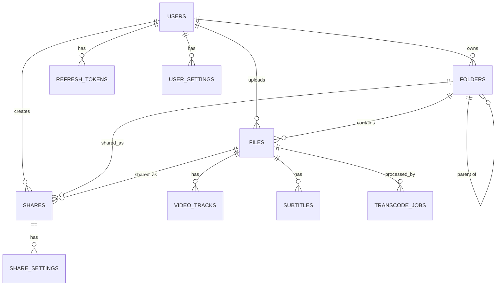

# Database & Models

## Schema Overview

Petrel uses SQLite with Drizzle ORM. The schema is defined in the backend.

## Entities

### Users
```typescript
{
  id: number;
  username: string;
  passwordHash: string;
  role: "admin" | "manager" | "editor" | "user" | "viewer" | "guest";
  createdAt: Date;
}
```

### Files
```typescript
{
  id: number;
  name: string;
  path: string;           // Full path in storage
  size: number;           // Bytes
  mimeType: string;
  hash: string;           // SHA-256 for deduplication
  uploadedBy: number | null;
  parentId: number | null; // Folder ID
  thumbnailPath: string | null;
  createdAt: Date;
}
```

### Folders
```typescript
{
  id: number;
  name: string;
  path: string;
  parentId: number | null;
  ownerId: number | null;
}
```

### Shares
```typescript
{
  id: number;
  type: "file" | "folder";
  targetId: number;       // File or folder ID
  token: string;          // Unique share token
  createdBy: number | null;
  expiresAt: Date | null;
  passwordHash: string | null;
  downloadCount: number;
  viewCount: number;
  createdAt: Date;
}
```

### Supporting Tables

- **refresh_tokens**: JWT refresh token storage with expiry and revocation
- **video_tracks**: Video/audio/subtitle track info
- **subtitles**: Extracted subtitle files
- **transcode_jobs**: Video transcoding queue status
- **zip_jobs**: ZIP archive generation job tracking
- **user_settings**: JSON user preferences
- **share_settings**: Per-share permission settings (allowDownload, allowZip, etc.)

## Entity Relationship Diagram



## Query Patterns

### Basic Queries

```typescript
import { db } from "../db";
import { files, folders } from "../db/schema";
import { eq, and, like, inArray, desc, asc } from "drizzle-orm";

// Single item
const file = await db.query.files.findFirst({
  where: eq(files.id, fileId)
});

// List with filter
const files = await db.query.files.findMany({
  where: and(
    eq(files.parentId, folderId),
    like(files.name, "%search%")
  ),
  limit: 50,
  offset: 0
});

// Join
const filesWithThumbnails = await db
  .select()
  .from(files)
  .leftJoin(folders, eq(files.parentId, folders.id))
  .where(eq(files.uploadedBy, userId));
```

### Insert

```typescript
const [newFile] = await db
  .insert(files)
  .values({
    name: "document.pdf",
    path: "/storage/document.pdf",
    size: 1024,
    mimeType: "application/pdf",
    hash: "abc123...",
    uploadedBy: 1,
    parentId: null
  })
  .returning();
```

### Update

```typescript
await db
  .update(files)
  .set({ name: "new-name.pdf" })
  .where(eq(files.id, fileId));
```

### Delete

```typescript
await db
  .delete(files)
  .where(eq(files.id, fileId));
```

## Advanced Query Patterns

### Eager Loading with Relations

```typescript
// Good: Eager load related data in single query
const folderWithContents = await db.query.folders.findFirst({
  where: eq(folders.id, folderId),
  with: {
    files: true,
    subfolders: true,
    owner: true
  }
});

// Good: Load files with their thumbnails
const filesWithThumbnails = await db.query.files.findMany({
  where: eq(files.parentId, folderId),
  with: {
    thumbnails: true,
    uploader: {
      columns: {
        id: true,
        username: true
      }
    }
  },
  limit: 50
});
```

### Complex Filters

```typescript
// Multiple conditions with AND/OR
const searchResults = await db.query.files.findMany({
  where: and(
    eq(files.parentId, folderId),
    or(
      like(files.name, `%${searchQuery}%`),
      like(files.mimeType, `%${searchQuery}%`)
    ),
    gt(files.size, 0),
    isNull(files.deletedAt)
  ),
  orderBy: [desc(files.createdAt)],
  limit: 50,
  offset: (page - 1) * 50
});
```

### Aggregation Queries

```typescript
import { count, sum, avg, sql } from "drizzle-orm";

// Count files in folder
const [result] = await db
  .select({ count: count() })
  .from(files)
  .where(eq(files.parentId, folderId));

// Total storage used by user
const [storage] = await db
  .select({ total: sum(files.size) })
  .from(files)
  .where(eq(files.uploadedBy, userId));

// Files by mime type
const mimeStats = await db
  .select({
    mimeType: files.mimeType,
    count: count(),
    totalSize: sum(files.size)
  })
  .from(files)
  .groupBy(files.mimeType);
```

### Pagination Patterns

```typescript
interface PaginationOptions {
  page: number;
  pageSize: number;
  sortBy: string;
  sortOrder: 'asc' | 'desc';
}

async function getPaginatedFiles(
  folderId: number | null,
  options: PaginationOptions
) {
  const { page, pageSize, sortBy, sortOrder } = options;
  
  // Get total count
  const [countResult] = await db
    .select({ count: count() })
    .from(files)
    .where(eq(files.parentId, folderId));
  
  // Get paginated results
  const items = await db.query.files.findMany({
    where: eq(files.parentId, folderId),
    orderBy: sortOrder === 'desc' 
      ? [desc(files[sortBy])] 
      : [asc(files[sortBy])],
    limit: pageSize,
    offset: (page - 1) * pageSize
  });
  
  return {
    items,
    total: countResult.count,
    page,
    pageSize,
    totalPages: Math.ceil(countResult.count / pageSize)
  };
}
```

### Cursor-Based Pagination

For large datasets, use cursor-based pagination:

```typescript
async function getFilesCursor(
  folderId: number | null,
  cursor: string | null,
  limit: number = 50
) {
  const decodedCursor = cursor 
    ? JSON.parse(Buffer.from(cursor, 'base64').toString())
    : null;
  
  const items = await db.query.files.findMany({
    where: and(
      eq(files.parentId, folderId),
      decodedCursor ? gt(files.id, decodedCursor.id) : undefined
    ),
    orderBy: [asc(files.id)],
    limit: limit + 1 // Fetch one extra to determine if there's a next page
  });
  
  const hasMore = items.length > limit;
  const results = hasMore ? items.slice(0, -1) : items;
  
  const nextCursor = hasMore 
    ? Buffer.from(JSON.stringify({ id: results[results.length - 1].id })).toString('base64')
    : null;
  
  return { items: results, nextCursor, hasMore };
}
```

## Transaction Patterns

### Basic Transaction

```typescript
async function moveFile(fileId: number, targetFolderId: number) {
  return await db.transaction(async (tx) => {
    // Get current file info
    const [file] = await tx
      .select()
      .from(files)
      .where(eq(files.id, fileId));
    
    if (!file) throw new Error('File not found');
    
    // Update file location
    const [updated] = await tx
      .update(files)
      .set({ parentId: targetFolderId })
      .where(eq(files.id, fileId))
      .returning();
    
    // Log the action
    await tx.insert(auditLogs).values({
      action: 'file:moved',
      userId: file.uploadedBy,
      targetId: fileId,
      details: JSON.stringify({ from: file.parentId, to: targetFolderId })
    });
    
    return updated;
  });
}
```

### Batch Operations

```typescript
async function deleteFiles(fileIds: number[]) {
  return await db.transaction(async (tx) => {
    // Mark files as deleted
    await tx
      .update(files)
      .set({ deletedAt: new Date() })
      .where(inArray(files.id, fileIds));
    
    // Create audit log entries
    await tx.insert(auditLogs).values(
      fileIds.map(id => ({
        action: 'file:deleted',
        targetId: id,
        timestamp: new Date()
      }))
    );
    
    // Queue cleanup jobs
    await tx.insert(cleanupJobs).values(
      fileIds.map(id => ({
        type: 'file:cleanup',
        targetId: id,
        scheduledAt: new Date(Date.now() + 24 * 60 * 60 * 1000) // 24 hours later
      }))
    );
  });
}
```

## Performance Considerations

### Indexing Strategy

The following indexes are defined in the schema:

```typescript
// Primary indexes (automatic)
- files.id
- folders.id
- users.id
- shares.id

// Foreign key indexes
- files.parentId
- files.uploadedBy
- folders.parentId
- folders.ownerId
- shares.targetId
- shares.createdBy

// Query performance indexes
- files.createdAt (for sorting)
- files.mimeType (for filtering)
- shares.token (unique, for lookups)
- shares.expiresAt (for cleanup jobs)
```

### Query Optimization Tips

1. **Always use `limit` for list queries**
   ```typescript
   // Good
   await db.query.files.findMany({ limit: 50 });
   
   // Bad - loads all files into memory
   await db.query.files.findMany();
   ```

2. **Select only needed columns**
   ```typescript
   // Good
   await db
     .select({ id: files.id, name: files.name })
     .from(files);
   
   // Bad - selects all columns
   await db.select().from(files);
   ```

3. **Use `with` for eager loading instead of N+1**
   ```typescript
   // Good - single query with joins
   const folders = await db.query.folders.findMany({
     with: { files: true }
   });
   
   // Bad - N+1 queries
   const folders = await db.query.folders.findMany();
   for (const folder of folders) {
     folder.files = await db.query.files.findMany({
       where: eq(files.parentId, folder.id)
     });
   }
   ```

4. **Use transactions for multi-step operations**
   ```typescript
   // Good - atomic operation
   await db.transaction(async (tx) => {
     await tx.insert(files).values(newFile);
     await tx.insert(auditLogs).values(logEntry);
   });
   ```

### N+1 Query Detection

Common N+1 patterns to avoid:

```typescript
// Anti-pattern: Loading thumbnails in loop
const files = await db.query.files.findMany({ limit: 50 });
for (const file of files) {
  // This executes 50 additional queries!
  file.thumbnail = await db.query.thumbnails.findFirst({
    where: eq(thumbnails.fileId, file.id)
  });
}

// Solution: Eager load
const files = await db.query.files.findMany({
  limit: 50,
  with: { thumbnails: true }
});
```

### Query Performance Monitoring

Enable query logging in development:

```typescript
// db/index.ts
import { drizzle } from "drizzle-orm/better-sqlite3";
import Database from "better-sqlite3";

const sqlite = new Database(process.env.DATABASE_PATH);

// Log slow queries in development
if (process.env.NODE_ENV === 'development') {
  sqlite.on('trace', (sql: string, time: number) => {
    if (time > 100) {
      console.warn(`Slow query (${time}ms): ${sql}`);
    }
  });
}

export const db = drizzle(sqlite);
```

## Migrations

Generate migrations after schema changes:

```bash
cd apps/backend
bun run db:generate
```

Apply migrations:

```bash
bun run db:push
```

### Migration Best Practices

1. **Never modify existing migrations** - create new ones
2. **Test migrations on a copy of production data**
3. **Make migrations reversible when possible**
4. **Add indexes in separate migrations** for large tables

### Custom Migration Example

```typescript
// drizzle/0004_add_file_search_index.sql
-- Add search index for file names
CREATE INDEX idx_files_name_search ON files(name COLLATE NOCASE);

-- Add full-text search virtual table
CREATE VIRTUAL TABLE files_fts USING fts5(
  name,
  content='files',
  content_rowid='id'
);

-- Populate FTS table
INSERT INTO files_fts(rowid, name)
SELECT id, name FROM files;
```

## Shared Types

Types are shared in `packages/shared`:

```typescript
// packages/shared/src/types/index.ts
export interface File {
  id: number;
  name: string;
  // ...
}
```

Import in both frontend and backend:

```typescript
import type { File, Folder } from "@petrel/shared";
```

## JSON Fields

User settings stored as JSON:

```typescript
// Schema
userSettings: text("settings", { mode: "json" })

// Usage
const settings: UserSettings = {
  theme: "dark",
  playback: { autoplay: true }
};

await db
  .update(users)
  .set({ settings })
  .where(eq(users.id, userId));
```

## Best Practices

1. **Always use typed queries**: Drizzle provides type safety
2. **Use transactions** for multi-step operations
3. **Index foreign keys**: Already in schema for `parentId`, `uploadedBy`
4. **Limit large queries**: Use pagination (limit/offset)
5. **Check for nulls**: SQLite is strict about null handling

## Date Handling

SQLite stores dates as ISO 8601 strings. Use consistent conversion:

```typescript
// Insert - Drizzle handles conversion
await db.insert(files).values({
  name: "test.txt",
  createdAt: new Date() // Converted to ISO string
});

// Select - Drizzle converts back to Date
const file = await db.query.files.findFirst();
// file.createdAt is a Date object
```

## Connection Pooling

For high-concurrency scenarios:

```typescript
// db/index.ts
import { drizzle } from "drizzle-orm/better-sqlite3";
import Database from "better-sqlite3";

const sqlite = new Database(process.env.DATABASE_PATH, {
  // Enable WAL mode for better concurrency
  wal: true,
  // Busy timeout in milliseconds
  timeout: 5000
});

export const db = drizzle(sqlite);
```

## Backup Strategy

```typescript
// scripts/backup.ts
import Database from "better-sqlite3";
import { createWriteStream } from "fs";
import { pipeline } from "stream/promises";

async function backupDatabase() {
  const source = new Database(process.env.DATABASE_PATH);
  const backupPath = `backups/petrel-${Date.now()}.db`;
  
  await source.backup(backupPath);
  console.log(`Database backed up to ${backupPath}`);
  
  source.close();
}

// Run backup daily
backupDatabase();
```

## Data Integrity

### Foreign Key Constraints

Ensure referential integrity:

```typescript
// Enable foreign keys
await db.run(sql`PRAGMA foreign_keys = ON`);

// Schema with cascading deletes
export const files = sqliteTable("files", {
  id: integer("id").primaryKey(),
  parentId: integer("parent_id").references(() => folders.id, {
    onDelete: "cascade" // Delete files when folder is deleted
  })
});
```

### Validation

Use Zod for runtime validation:

```typescript
import { z } from "zod";

const FileSchema = z.object({
  name: z.string().min(1).max(255),
  size: z.number().positive(),
  mimeType: z.string().regex(/^\w+\/[-+.\w]+$/)
});

// Validate before insert
const validated = FileSchema.parse(inputData);
await db.insert(files).values(validated);
```
