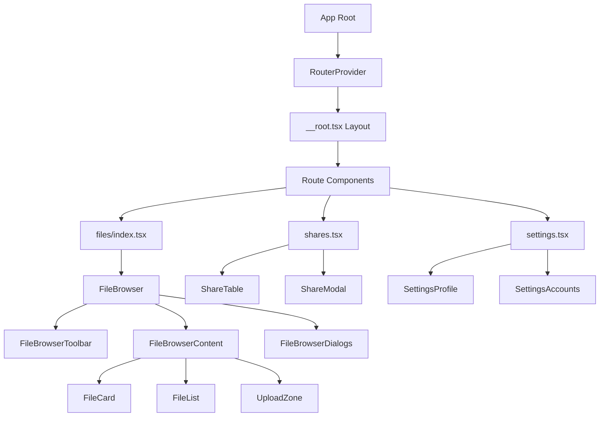

# Frontend Development

## Routing

TanStack Router uses file-based routing. Files in `src/routes/` become URLs:

```
routes/
├── __root.tsx              # Root layout (wraps all pages)
├── index.tsx               # Redirect to /files
├── files/
│   ├── index.tsx           # /files (file browser root)
│   └── $folderId.tsx       # /files/:folderId (specific folder)
├── s/
│   └── $token.tsx          # /s/:token (public share)
├── shares.tsx              # /shares (manage shares)
└── settings.tsx            # /settings
```

### Creating a Route

```typescript
// routes/my-route.tsx
import { createFileRoute } from "@tanstack/react-router";

export const Route = createFileRoute("/my-route")({
  component: MyRouteComponent,
});

function MyRouteComponent() {
  return <div>My Route</div>;
}
```

## Component Hierarchy

### Application Structure



### Component Organization by Domain

```
components/
├── ui/                    # shadcn primitives (Button, Input, Dialog)
│   ├── button.tsx
│   └── dialog.tsx
├── file-browser/          # File management components
│   ├── FileBrowser.tsx    # Main container (550+ lines - needs refactoring)
│   ├── FileCard.tsx       # Individual file display
│   ├── FileList.tsx       # List view of files
│   ├── FileGrid.tsx       # Grid view of files
│   ├── UploadZone.tsx     # Drag-and-drop upload
│   ├── FileDialogs.tsx    # Dialogs for file operations
│   ├── types.ts           # Component-specific types
│   └── utils.ts           # File browser utilities
├── viewers/               # Media viewers
│   ├── video-player/
│   │   ├── VideoPlayer.tsx
│   │   ├── VideoControls.tsx
│   │   ├── useVideoPlayer.ts
│   │   └── types.ts
│   ├── audio-player/
│   ├── image-viewer/
│   └── document-viewer/
├── sharing/               # Share-related components
│   ├── CreateShareModal.tsx
│   └── ShareTable.tsx
├── auth/                  # Authentication components
│   ├── LoginForm.tsx
│   └── CreateAdminForm.tsx
├── navigation/            # Navigation components
│   ├── Sidebar.tsx
│   ├── FolderBreadcrumb.tsx
│   └── PageBar.tsx
├── settings/              # Settings components
│   ├── SettingsProfile.tsx
│   └── SettingsAccounts.tsx
└── global-context-menu/   # Global right-click context menu
    ├── ContextMenuProvider.tsx
    ├── GlobalContextMenu.tsx
    └── useContextMenu.ts
```

## State Management Patterns

### Server State with TanStack Query

```typescript
// hooks/useFiles.ts
import { useQuery, useMutation, useQueryClient } from "@tanstack/react-query";

export function useFiles(folderId: number | null) {
  return useQuery({
    queryKey: ["files", folderId],
    queryFn: () => api.files.list(folderId),
    staleTime: 30000, // 30 seconds
  });
}

export function useCreateFile() {
  const queryClient = useQueryClient();
  
  return useMutation({
    mutationFn: api.files.create,
    onSuccess: () => {
      // Invalidate and refetch
      queryClient.invalidateQueries({ queryKey: ["files"] });
    },
  });
}

export function useDeleteFile() {
  const queryClient = useQueryClient();
  
  return useMutation({
    mutationFn: api.files.delete,
    onMutate: async (fileId) => {
      // Optimistic update
      await queryClient.cancelQueries({ queryKey: ["files"] });
      const previousFiles = queryClient.getQueryData(["files"]);
      
      queryClient.setQueryData(["files"], (old) => 
        old?.filter(f => f.id !== fileId)
      );
      
      return { previousFiles };
    },
    onError: (err, fileId, context) => {
      // Rollback on error
      queryClient.setQueryData(["files"], context.previousFiles);
    },
    onSettled: () => {
      queryClient.invalidateQueries({ queryKey: ["files"] });
    },
  });
}
```

### Local UI State with React Hooks

```typescript
// Good: Local state for UI only
function FileCard({ file }: FileCardProps) {
  const [isHovered, setIsHovered] = useState(false);
  const [isRenaming, setIsRenaming] = useState(false);
  
  return (
    <div
      onMouseEnter={() => setIsHovered(true)}
      onMouseLeave={() => setIsHovered(false)}
    >
      {isRenaming ? <RenameInput /> : <FileName />}
    </div>
  );
}
```

### Custom Hooks for Complex Logic

```typescript
// hooks/useFileSelection.ts
export function useFileSelection(files: File[]) {
  const [selectedIds, setSelectedIds] = useState<Set<number>>(new Set());
  
  const toggleSelection = useCallback((id: number) => {
    setSelectedIds(prev => {
      const next = new Set(prev);
      if (next.has(id)) {
        next.delete(id);
      } else {
        next.add(id);
      }
      return next;
    });
  }, []);
  
  const selectAll = useCallback(() => {
    setSelectedIds(new Set(files.map(f => f.id)));
  }, [files]);
  
  const clearSelection = useCallback(() => {
    setSelectedIds(new Set());
  }, []);
  
  const selectedFiles = useMemo(() => 
    files.filter(f => selectedIds.has(f.id)),
    [files, selectedIds]
  );
  
  return {
    selectedIds,
    selectedFiles,
    toggleSelection,
    selectAll,
    clearSelection,
    hasSelection: selectedIds.size > 0,
  };
}
```

## FileBrowser Component Decomposition

### Current Problem

The `FileBrowser` component has grown to 550+ lines with mixed concerns:
- File data management
- Selection state
- Upload state and progress
- View mode (grid/list)
- Context menu handling
- Dialog management
- Breadcrumb navigation

### Recommended Refactoring

#### Step 1: Extract Custom Hooks

```typescript
// file-browser/hooks/useFileBrowser.ts
export function useFileBrowser(folderId: number | null) {
  const { data: files, isLoading } = useFiles(folderId);
  const { data: currentFolder } = useFolder(folderId);
  const selection = useFileSelection(files ?? []);
  const upload = useFileUpload(folderId);
  const [viewMode, setViewMode] = useState<'grid' | 'list'>('grid');
  
  return {
    files,
    currentFolder,
    isLoading,
    selection,
    upload,
    viewMode,
    setViewMode,
  };
}

// file-browser/hooks/useFileUpload.ts
export function useFileUpload(folderId: number | null) {
  const [uploads, setUploads] = useState<UploadState[]>([]);
  const createFile = useCreateFile();
  
  const addUpload = useCallback((file: File) => {
    const uploadId = crypto.randomUUID();
    setUploads(prev => [...prev, { id: uploadId, file, progress: 0 }]);
    
    createFile.mutate(
      { file, folderId },
      {
        onProgress: (progress) => {
          setUploads(prev =>
            prev.map(u =>
              u.id === uploadId ? { ...u, progress } : u
            )
          );
        },
        onSettled: () => {
          setUploads(prev => prev.filter(u => u.id !== uploadId));
        },
      }
    );
    
    return uploadId;
  }, [folderId, createFile]);
  
  const cancelUpload = useCallback((uploadId: string) => {
    // Cancel logic
  }, []);
  
  return { uploads, addUpload, cancelUpload };
}
```

#### Step 2: Extract Sub-components

```typescript
// file-browser/FileBrowserToolbar.tsx
interface FileBrowserToolbarProps {
  currentFolder: Folder | null;
  viewMode: 'grid' | 'list';
  onViewModeChange: (mode: 'grid' | 'list') => void;
  selectionCount: number;
  onSelectAll: () => void;
  onClearSelection: () => void;
  onUploadClick: () => void;
  onCreateFolder: () => void;
}

export function FileBrowserToolbar({
  currentFolder,
  viewMode,
  onViewModeChange,
  selectionCount,
  onSelectAll,
  onClearSelection,
  onUploadClick,
  onCreateFolder,
}: FileBrowserToolbarProps) {
  return (
    <div className="flex items-center justify-between p-4">
      <FolderBreadcrumb folder={currentFolder} />
      <div className="flex items-center gap-2">
        {selectionCount > 0 && (
          <SelectionActions
            count={selectionCount}
            onSelectAll={onSelectAll}
            onClear={onClearSelection}
          />
        )}
        <ViewModeToggle mode={viewMode} onChange={onViewModeChange} />
        <Button onClick={onUploadClick}>Upload</Button>
        <Button onClick={onCreateFolder}>New Folder</Button>
      </div>
    </div>
  );
}

// file-browser/FileBrowserContent.tsx
interface FileBrowserContentProps {
  files: File[];
  isLoading: boolean;
  viewMode: 'grid' | 'list';
  selectedIds: Set<number>;
  onToggleSelection: (id: number) => void;
  onFileClick: (file: File) => void;
  onContextMenu: (e: React.MouseEvent, file: File) => void;
}

export function FileBrowserContent({
  files,
  isLoading,
  viewMode,
  selectedIds,
  onToggleSelection,
  onFileClick,
  onContextMenu,
}: FileBrowserContentProps) {
  if (isLoading) return <FileBrowserSkeleton />;
  if (files.length === 0) return <EmptyState />;
  
  const Component = viewMode === 'grid' ? FileGrid : FileList;
  
  return (
    <Component
      files={files}
      selectedIds={selectedIds}
      onToggleSelection={onToggleSelection}
      onFileClick={onFileClick}
      onContextMenu={onContextMenu}
    />
  );
}

// file-browser/FileBrowserDialogs.tsx
interface FileBrowserDialogsProps {
  activeDialog: DialogType | null;
  selectedFiles: File[];
  onClose: () => void;
}

export function FileBrowserDialogs({
  activeDialog,
  selectedFiles,
  onClose,
}: FileBrowserDialogsProps) {
  return (
    <>
      <DeleteDialog
        isOpen={activeDialog === 'delete'}
        files={selectedFiles}
        onClose={onClose}
      />
      <RenameDialog
        isOpen={activeDialog === 'rename'}
        file={selectedFiles[0]}
        onClose={onClose}
      />
      <ShareDialog
        isOpen={activeDialog === 'share'}
        files={selectedFiles}
        onClose={onClose}
      />
      <MoveDialog
        isOpen={activeDialog === 'move'}
        files={selectedFiles}
        onClose={onClose}
      />
    </>
  );
}
```

#### Step 3: Refactored Main Component

```typescript
// file-browser/FileBrowser.tsx
export function FileBrowser() {
  const { folderId } = useParams({ from: '/files/$folderId' });
  const {
    files,
    currentFolder,
    isLoading,
    selection,
    upload,
    viewMode,
    setViewMode,
  } = useFileBrowser(folderId);
  
  const [activeDialog, setActiveDialog] = useState<DialogType | null>(null);
  const { showContextMenu } = useContextMenu();
  
  const handleContextMenu = useCallback((e: React.MouseEvent, file: File) => {
    e.preventDefault();
    if (!selection.selectedIds.has(file.id)) {
      selection.toggleSelection(file.id);
    }
    
    showContextMenu(e, [
      { label: 'Open', onClick: () => openFile(file) },
      { label: 'Share', onClick: () => setActiveDialog('share') },
      { label: 'Rename', onClick: () => setActiveDialog('rename') },
      { label: 'Move', onClick: () => setActiveDialog('move') },
      { label: 'Delete', onClick: () => setActiveDialog('delete'), danger: true },
    ]);
  }, [selection, showContextMenu]);
  
  return (
    <div className="flex flex-col h-full">
      <FileBrowserToolbar
        currentFolder={currentFolder}
        viewMode={viewMode}
        onViewModeChange={setViewMode}
        selectionCount={selection.selectedIds.size}
        onSelectAll={selection.selectAll}
        onClearSelection={selection.clearSelection}
        onUploadClick={() => document.getElementById('file-input')?.click()}
        onCreateFolder={() => setActiveDialog('createFolder')}
      />
      
      <UploadProgress uploads={upload.uploads} />
      
      <FileBrowserContent
        files={files ?? []}
        isLoading={isLoading}
        viewMode={viewMode}
        selectedIds={selection.selectedIds}
        onToggleSelection={selection.toggleSelection}
        onFileClick={openFile}
        onContextMenu={handleContextMenu}
      />
      
      <FileBrowserDialogs
        activeDialog={activeDialog}
        selectedFiles={selection.selectedFiles}
        onClose={() => setActiveDialog(null)}
      />
      
      <input
        id="file-input"
        type="file"
        multiple
        className="hidden"
        onChange={(e) => {
          Array.from(e.target.files ?? []).forEach(upload.addUpload);
        }}
      />
    </div>
  );
}
```

### File Structure After Refactoring

```
file-browser/
├── FileBrowser.tsx              # Main container (~100 lines)
├── FileBrowserToolbar.tsx       # Toolbar component
├── FileBrowserContent.tsx       # Content area
├── FileBrowserDialogs.tsx       # Dialog management
├── FileCard.tsx                 # Individual file card
├── FileList.tsx                 # List view
├── FileGrid.tsx                 # Grid view
├── UploadZone.tsx               # Upload area
├── UploadProgress.tsx           # Upload progress indicator
├── types.ts                     # Component types
├── utils.ts                     # Shared utilities
├── hooks/
│   ├── useFileBrowser.ts        # Main hook
│   ├── useFileSelection.ts      # Selection logic
│   ├── useFileUpload.ts         # Upload logic
│   └── useContextMenuActions.ts # Context menu handlers
└── index.ts                     # Re-exports
```

## Component Patterns

### Functional Components with Hooks

```typescript
// components/file-browser/FileCard.tsx
import { useState, useCallback } from "react";
import { cn } from "@/lib/utils";

interface FileCardProps {
  file: File;
  isSelected: boolean;
  onSelect: (file: File) => void;
  onContextMenu: (e: React.MouseEvent, file: File) => void;
}

export function FileCard({ 
  file, 
  isSelected, 
  onSelect, 
  onContextMenu 
}: FileCardProps) {
  const [isHovered, setIsHovered] = useState(false);
  
  const handleClick = useCallback(() => {
    onSelect(file);
  }, [file, onSelect]);
  
  const handleContextMenu = useCallback((e: React.MouseEvent) => {
    onContextMenu(e, file);
  }, [file, onContextMenu]);
  
  return (
    <div
      className={cn(
        "p-4 border rounded cursor-pointer transition-colors",
        isSelected && "bg-primary/10 border-primary",
        isHovered && !isSelected && "bg-accent"
      )}
      onMouseEnter={() => setIsHovered(true)}
      onMouseLeave={() => setIsHovered(false)}
      onClick={handleClick}
      onContextMenu={handleContextMenu}
    >
      <FileIcon mimeType={file.mimeType} />
      <span className="truncate">{file.name}</span>
    </div>
  );
}
```

## Custom Hooks

Extract reusable logic:

```typescript
// components/viewers/video-player/useVideoPlayer.ts
import { useRef, useState, useEffect, useCallback } from "react";
import Hls from "hls.js";

export function useVideoPlayer(src: string) {
  const videoRef = useRef<HTMLVideoElement>(null);
  const [isPlaying, setIsPlaying] = useState(false);
  const [currentTime, setCurrentTime] = useState(0);
  const [duration, setDuration] = useState(0);
  const [volume, setVolume] = useState(1);
  
  useEffect(() => {
    const video = videoRef.current;
    if (!video) return;
    
    // HLS support
    if (Hls.isSupported() && src.endsWith('.m3u8')) {
      const hls = new Hls();
      hls.loadSource(src);
      hls.attachMedia(video);
      
      return () => hls.destroy();
    } else {
      video.src = src;
    }
  }, [src]);
  
  const play = useCallback(() => {
    videoRef.current?.play();
    setIsPlaying(true);
  }, []);
  
  const pause = useCallback(() => {
    videoRef.current?.pause();
    setIsPlaying(false);
  }, []);
  
  const seek = useCallback((time: number) => {
    if (videoRef.current) {
      videoRef.current.currentTime = time;
      setCurrentTime(time);
    }
  }, []);
  
  return {
    videoRef,
    isPlaying,
    currentTime,
    duration,
    volume,
    play,
    pause,
    seek,
    setVolume,
  };
}
```

## Context Menu System

Global context menus via provider:

```typescript
// In your component
const { showContextMenu } = useContextMenu();

const handleRightClick = (e: MouseEvent, file: File) => {
  e.preventDefault();
  showContextMenu(e, [
    { label: "Download", onClick: () => download(file) },
    { label: "Share", onClick: () => share(file) },
    { label: "Delete", onClick: () => delete(file), danger: true },
  ]);
};
```

## Styling

Tailwind CSS with `cn()` utility for conditional classes:

```typescript
import { cn } from "@/lib/utils";

<div className={cn(
  "base-classes",
  isActive && "active-classes",
  size === "large" ? "text-lg" : "text-sm"
)}>
```

### Common Patterns

```typescript
// Card pattern
<div className="bg-card text-card-foreground rounded-lg border shadow-sm p-4">

// Button variants
<button className={cn(
  "inline-flex items-center justify-center rounded-md text-sm font-medium",
  "transition-colors focus-visible:outline-none",
  variant === 'primary' && "bg-primary text-primary-foreground hover:bg-primary/90",
  variant === 'secondary' && "bg-secondary text-secondary-foreground hover:bg-secondary/80",
  variant === 'danger' && "bg-destructive text-destructive-foreground hover:bg-destructive/90",
  size === 'sm' && "h-8 px-3",
  size === 'md' && "h-10 px-4",
  size === 'lg' && "h-12 px-6",
)}>

// Layout patterns
<div className="flex items-center gap-2">
<div className="grid grid-cols-3 gap-4">
<div className="space-y-4">
```

## API Client

Use the typed API client in `src/lib/api.ts`:

```typescript
import { api } from "@/lib/api";

// GET files in folder
const { items, currentFolder } = await api.getFiles({ folderId: 1 });

// GET single file
const file = await api.getFile(fileId);

// Upload with progress
await api.uploadFile(file, folderId, (progress) => {
  console.log(`${progress}%`);
});

// Create share
const share = await api.createShare({
  type: "file",
  targetId: fileId,
  expiresAt: "2026-12-31",
});
```

## Testing

Frontend tests use Vitest with React Testing Library:

```typescript
// FileCard.test.tsx
import { describe, expect, it, vi } from "vitest";
import { render, screen, fireEvent } from "@testing-library/react";
import { FileCard } from "./FileCard";

describe("FileCard", () => {
  const mockFile = {
    id: 1,
    name: "test.txt",
    mimeType: "text/plain",
    size: 1024,
  };
  
  it("renders file name", () => {
    render(<FileCard file={mockFile} isSelected={false} />);
    expect(screen.getByText("test.txt")).toBeInTheDocument();
  });
  
  it("calls onSelect when clicked", () => {
    const onSelect = vi.fn();
    render(
      <FileCard 
        file={mockFile} 
        isSelected={false} 
        onSelect={onSelect} 
      />
    );
    
    fireEvent.click(screen.getByText("test.txt"));
    expect(onSelect).toHaveBeenCalledWith(mockFile);
  });
  
  it("applies selected styles", () => {
    render(<FileCard file={mockFile} isSelected={true} />);
    expect(screen.getByRole("article")).toHaveClass("bg-primary/10");
  });
});
```

Run with `bunx vitest`.

### Testing with Providers

```typescript
// test/utils.tsx
import { QueryClient, QueryClientProvider } from "@tanstack/react-query";
import { render } from "@testing-library/react";

const queryClient = new QueryClient({
  defaultOptions: {
    queries: { retry: false },
  },
});

export function renderWithProviders(ui: React.ReactElement) {
  return render(
    <QueryClientProvider client={queryClient}>
      {ui}
    </QueryClientProvider>
  );
}
```

## Error Boundaries

Catch errors with error boundaries:

```typescript
import { ErrorBoundary } from "@/components/ErrorBoundary";

<ErrorBoundary fallback={<ErrorMessage />}>
  <FileBrowser />
</ErrorBoundary>
```

### Error Boundary Component

```typescript
// components/ErrorBoundary.tsx
import { Component, ReactNode } from "react";

interface Props {
  children: ReactNode;
  fallback: ReactNode;
}

interface State {
  hasError: boolean;
  error?: Error;
}

export class ErrorBoundary extends Component<Props, State> {
  state: State = { hasError: false };
  
  static getDerivedStateFromError(error: Error): State {
    return { hasError: true, error };
  }
  
  componentDidCatch(error: Error, info: React.ErrorInfo) {
    logger.error("Component error:", error, info);
  }
  
  render() {
    if (this.state.hasError) {
      return this.props.fallback;
    }
    return this.props.children;
  }
}
```

## Performance

### Memoization

```typescript
import { memo, useMemo } from "react";

// Memoize expensive components
export const FileCard = memo(function FileCard({ file }: FileCardProps) {
  // Component logic
});

// Memoize expensive computations
const filteredFiles = useMemo(() => {
  return files.filter(f => f.name.includes(searchQuery));
}, [files, searchQuery]);
```

### Virtualization

For long lists, use virtualization:

```typescript
import { useVirtualizer } from "@tanstack/react-virtual";

function FileList({ files }: { files: File[] }) {
  const parentRef = useRef<HTMLDivElement>(null);
  
  const virtualizer = useVirtualizer({
    count: files.length,
    getScrollElement: () => parentRef.current,
    estimateSize: () => 60,
  });
  
  return (
    <div ref={parentRef} className="h-[600px] overflow-auto">
      <div style={{ height: `${virtualizer.getTotalSize()}px` }}>
        {virtualizer.getVirtualItems().map((virtualItem) => (
          <div
            key={virtualItem.key}
            style={{
              position: "absolute",
              top: 0,
              left: 0,
              width: "100%",
              height: `${virtualItem.size}px`,
              transform: `translateY(${virtualItem.start}px)`,
            }}
          >
            <FileCard file={files[virtualItem.index]} />
          </div>
        ))}
      </div>
    </div>
  );
}
```

### Lazy Loading

```typescript
import { lazy, Suspense } from "react";

const VideoPlayer = lazy(() => import("./viewers/VideoPlayer"));
const AudioPlayer = lazy(() => import("./viewers/AudioPlayer"));

function FileViewer({ file }: { file: File }) {
  return (
    <Suspense fallback={<LoadingSpinner />}>
      {file.mimeType.startsWith("video/") && <VideoPlayer file={file} />}
      {file.mimeType.startsWith("audio/") && <AudioPlayer file={file} />}
    </Suspense>
  );
}
```

## Image Optimization

```typescript
// Lazy loading with blur placeholder
 e.currentTarget.classList.remove("blur-sm")}
/>
```
