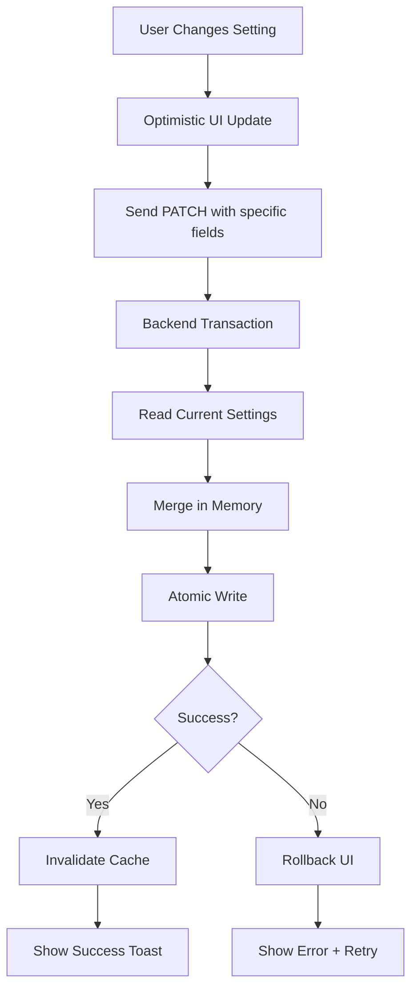

# Settings Persistence Failure - Debug & Resolution Plan

## Critical Issues Identified

### 1. Frontend State Update Pattern (CRITICAL)
**File**: `apps/frontend/src/routes/settings.tsx:79-88`

**Problem**: The `handleUpdate` function sends the entire merged settings object instead of only the changed fields. This causes:
- Race conditions with concurrent updates
- Unnecessary data transfer
- Potential overwrites of concurrent changes

**Current Code**:
```typescript
function handleUpdate<K extends keyof UserSettings>(
  section: K,
  updates: Partial<UserSettings[K]>,
): void {
  if (!settings) return;
  const sectionData = settings[section] as Record<string, unknown>;
  const mergedSection = deepMerge(sectionData, updates);
  const merged = { ...settings, [section]: mergedSection };
  updateMutation.mutate(merged as Partial<UserSettings>); // ❌ Sends entire object
}
```

**Solution**: Send only the specific section updates, not the entire settings object.

---

### 2. Missing Optimistic Updates (CRITICAL)
**File**: `apps/frontend/src/routes/settings.tsx:56-66`

**Problem**: The mutation doesn't use optimistic updates, causing UI lag and perceived failure when settings appear not to change immediately.

**Solution**: Implement TanStack Query's `onMutate` for immediate UI feedback with rollback capability.

---

### 3. Backend Transaction Integrity (HIGH)
**File**: `apps/backend/src/modules/settings/service.ts:90-118`

**Problem**: The update flow reads current settings, merges, then writes - but there's no database transaction ensuring atomicity. If two requests process simultaneously, one may overwrite the other.

**Current Code**:
```typescript
async updateSettings(userId: number, updates: Partial<UserSettings>): Promise<UserSettings> {
  const current = await this.getUserSettings(userId); // Read
  const merged = this.deepMerge(current, updates);    // Merge in memory
  // ... potential race condition here
  await db.update(userSettings).set({ settings: merged }); // Write
}
```

**Solution**: Use SQLite transactions with Drizzle ORM to ensure atomic read-modify-write cycles.

---

### 4. State Hydration Timing (MEDIUM)
**File**: `apps/frontend/src/routes/settings.tsx:42-54`

**Problem**: The settings query doesn't have proper staleTime or cache invalidation strategy, potentially serving stale data after updates.

**Solution**: Configure proper cache settings and ensure immediate invalidation on mutation success.

---

### 5. Missing Error Boundaries (MEDIUM)
**Files**: 
- `apps/frontend/src/routes/settings.tsx`
- `apps/frontend/src/components/settings/SettingsSharing.tsx`

**Problem**: No error boundaries to gracefully handle persistence failures, leading to silent failures or app crashes.

**Solution**: Implement React Error Boundaries around settings sections with fallback UI.

---

### 6. No Persistence Status Indicators (MEDIUM)
**File**: `apps/frontend/src/components/settings/SettingsSharing.tsx`

**Problem**: Users receive no visual feedback when settings are being saved, saved successfully, or failed to save.

**Solution**: Add loading spinners, success indicators, and error messages on individual setting controls.

---

## Implementation Steps

### Phase 1: Fix Frontend Update Pattern
1. Modify `handleUpdate` to send only changed fields
2. Structure updates as `{ section: { field: value } }`

### Phase 2: Implement Optimistic Updates
1. Add `onMutate` to update query cache immediately
2. Add `onError` to rollback on failure
3. Implement `retry` logic for transient failures

### Phase 3: Backend Transaction Safety
1. Wrap database operations in SQLite transactions
2. Use row-level locking or optimistic concurrency control
3. Add proper error handling and logging

### Phase 4: Error Boundaries & Feedback
1. Create `SettingsErrorBoundary` component
2. Add persistence status indicators to each control
3. Implement auto-retry with exponential backoff

### Phase 5: Testing & Validation
1. Test concurrent updates
2. Test network failure scenarios
3. Test across browser sessions
4. Verify data integrity on page refresh

---

## Data Flow Architecture (After Fix)



---

## Validation Checklist

- [ ] Settings persist across page refreshes
- [ ] Settings persist across user logouts/logins
- [ ] Concurrent updates don't cause data loss
- [ ] Network failures show clear error messages
- [ ] UI updates immediately on change (optimistic)
- [ ] Failed saves rollback UI to previous state
- [ ] Each setting shows its own save status
- [ ] Default settings load correctly for new users
